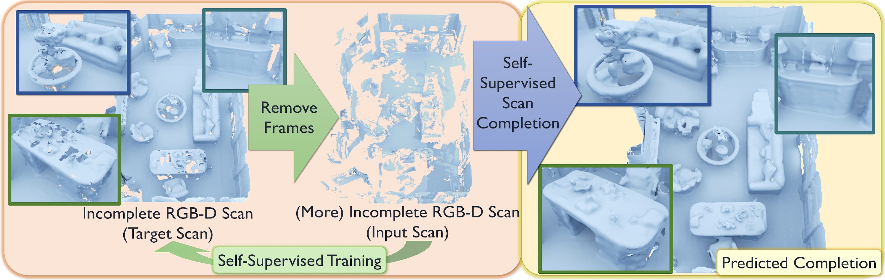

# SG-NN

SG-NN presents a self-supervised approach that converts partial and noisy RGB-D scans into high-quality 3D scene reconstructions by inferring unobserved scene geometry. For more details please see our paper [
SG-NN: Sparse Generative Neural Networks for Self-Supervised Scene Completion of RGB-D Scans](https://arxiv.org/pdf/1912.00036.pdf).

[](https://arxiv.org/abs/1912.00036)


## Code
### Installation:  
Training is implemented with [PyTorch](https://pytorch.org/). This code was developed under PyTorch 1.1.0, Python 2.7, and uses [SparseConvNet](https://github.com/facebookresearch/SparseConvNet).

For visualization, please install the marching cubes by `python setup.py install` in `marching_cubes`.

### Training:  
* See `python train.py --help` for all train options. 
* Example command: `python train.py --gpu 0 --data_path ./data/completion_blocks --train_file_list ../filelists/train_list.txt --val_file_list ../filelists/val_list.txt --save_epoch 1 --save logs/mp --max_epoch 4`
* Trained model: [sgnn.pth](http://kaldir.vc.in.tum.de/adai/SGNN/sgnn.pth) (7.5M)

### Testing
* See `python test_scene.py --help` for all test options. 
* Example command: `python test_scene.py --gpu 0 --input_data_path ./data/mp_sdf_vox_2cm_input --target_data_path ./data/mp_sdf_vox_2cm_target --test_file_list ../filelists/mp-rooms_val-scenes.txt --model_path sgnn.pth --output ./output  --max_to_vis 20`

### Data:
* Scene data: 
  - [mp_sdf_vox_2cm_input.zip](http://kaldir.vc.in.tum.de/adai/SGNN/mp_sdf_vox_2cm_input.zip) (44G)
  - [mp_sdf_vox_2cm_target.zip](http://kaldir.vc.in.tum.de/adai/SGNN/mp_sdf_vox_2cm_target.zip) (58G)
* Train data:
  - [completion_blocks.zip](http://kaldir.vc.in.tum.de/adai/SGNN/completion_blocks.zip) (88G)

## Citation:  
If you find our work useful in your research, please consider citing:
```
@inproceedings{dai2020sgnn,
 title={SG-NN: Sparse Generative Neural Networks for Self-Supervised Scene Completion of RGB-D Scans},
 author = {Dai, Angela and Diller, Christian and Nie{\ss}ner, Matthias},
 booktitle = {Proc. Computer Vision and Pattern Recognition (CVPR), IEEE},
 year = {2020}
}
```
